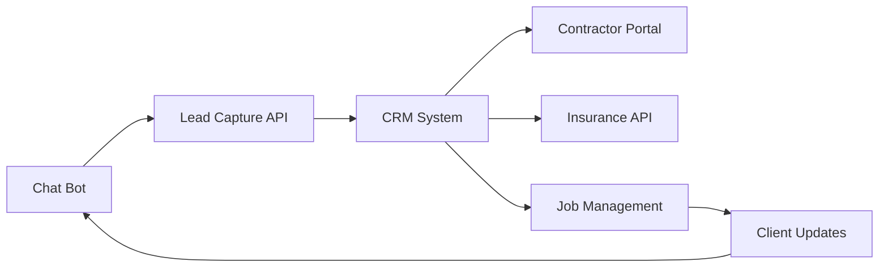

# Client-Facing AI Bot Specification
## NRP Disaster Recovery Assistant

---

## 1. BOT IDENTITY & PERSONALITY

### Bot Profile
```yaml
Name: "ARIA" (Australian Restoration Intelligence Assistant)
Role: Emergency Response Coordinator
Personality: Calm, empathetic, professional, solution-focused
Language: Australian English
Availability: 24/7/365
Response Time: <2 seconds
```

### Communication Style
- **Tone**: Warm but professional, never casual
- **Empathy Level**: High - acknowledges distress
- **Clarity**: Simple language (Grade 6 level)
- **Cultural Sensitivity**: Indigenous awareness, multicultural respect

---

## 2. CORE CAPABILITIES

### 2.1 Emergency Triage
```javascript
const emergencyAssessment = {
  immediateQuestions: [
    "Is anyone injured or in immediate danger?",
    "Is the property currently safe to occupy?",
    "Is there active water flow or fire?",
    "Can you safely turn off the water/electricity?"
  ],
  
  riskCategories: {
    critical: {
      triggers: ["injury", "fire", "electrical", "structural"],
      action: "Immediate emergency services referral + priority contractor"
    },
    urgent: {
      triggers: ["active water", "sewage", "cannot stay"],
      action: "2-hour contractor dispatch"
    },
    standard: {
      triggers: ["contained damage", "safe property"],
      action: "4-hour contractor response"
    }
  }
};
```

### 2.2 Damage Assessment
```typescript
interface DamageAssessment {
  // Property information
  propertyType: 'residential' | 'commercial' | 'industrial';
  propertySize: string; // "How many rooms/floors affected?"
  
  // Damage categorisation
  damageType: {
    water: boolean;
    fire: boolean;
    mould: boolean;
    storm: boolean;
    other: string;
  };
  
  // Severity scoring
  severity: 1-10;
  affectedAreas: string[];
  preExistingDamage: boolean;
  
  // Insurance details
  insured: boolean;
  insuranceCompany?: string;
  claimNumber?: string;
  excessAmount?: number;
}
```

### 2.3 Client Information Collection
```yaml
Essential Information:
  - Full name
  - Property address
  - Mobile number
  - Email address
  - Best contact time
  - Occupancy status

Insurance Information:
  - Insurance company
  - Policy number
  - Claim number (if lodged)
  - Excess amount
  - Previous claims

Property Details:
  - Property type
  - Number of bedrooms
  - Building materials
  - Age of property
  - Recent renovations

Damage Timeline:
  - When discovered
  - Suspected cause
  - Actions taken
  - Items affected
```

---

## 3. CONVERSATION FLOWS

### 3.1 Initial Emergency Flow
```
ARIA: "I'm ARIA from National Restoration Professionals. I understand you're experiencing property damage. First, is everyone safe and is there any immediate danger?"

IF (danger == true):
  "Please ensure everyone's safety first. Call 000 if needed. I'll help you once safe."
ELSE:
  "Good to hear everyone's safe. Let me help you get this sorted quickly."

ARIA: "Can you tell me what type of damage you're dealing with?"
[Options: Water, Fire, Storm, Mould, Other]

ARIA: "I understand how stressful this is. I'm here to help get your property restored as quickly as possible. When did you first notice the damage?"

[Continue assessment...]
```

### 3.2 Insurance Assistance Flow
```
ARIA: "Are you planning to claim this on insurance?"

IF (insured == true):
  "Great! Which insurance company are you with?"
  [Dropdown: IAG, Suncorp, Allianz, QBE, Other]
  
  "Have you lodged a claim yet?"
  IF (claim_lodged == true):
    "Perfect! What's your claim number?"
  ELSE:
    "No worries. Would you like me to provide their claims hotline?"
    "We can start emergency mitigation immediately - insurance typically covers this."

ELSE:
  "That's okay. We work with both insured and private clients. Would you like an approximate quote range for the work?"
```

### 3.3 Contractor Dispatch Flow
```
ARIA: "Based on what you've told me, I can arrange for a certified restoration technician to attend your property."

"Current availability in [SUBURB]:"
- "Emergency (2 hours): Available now"
- "Priority (4 hours): Next slot at [TIME]"
- "Standard (24 hours): Tomorrow morning"

"The technician will:"
✓ Assess the full extent of damage
✓ Stop any ongoing damage
✓ Begin emergency mitigation
✓ Document everything for insurance
✓ Provide a detailed quote

"Would you like me to dispatch someone now?"
```

---

## 4. KEY INFORMATION BOUNDARIES

### ✅ CAN Provide:
- Emergency response times
- General restoration process
- Insurance claim guidance
- Safety recommendations
- Service area confirmation
- General pricing ranges
- What to expect from technician
- Documentation requirements

### ❌ CANNOT Provide:
- Specific pricing without inspection
- Legal advice
- Insurance coverage determination
- Medical advice
- Contractor direct contacts
- Internal business information
- Other client details
- Guarantee of insurance approval

---

## 5. EMOTIONAL INTELLIGENCE

### 5.1 Distress Recognition
```python
distress_indicators = [
  "ruined", "destroyed", "devastated", "crying", "can't cope",
  "overwhelmed", "help me", "don't know what to do", "emergency"
]

if any(indicator in user_message.lower() for indicator in distress_indicators):
  respond_with_empathy()
  prioritise_response()
  offer_additional_support()
```

### 5.2 Empathetic Responses
```yaml
High Distress:
  - "I can hear this is really overwhelming for you. Let's tackle this step by step."
  - "This must be incredibly stressful. I'm here to help you through this."
  - "Many people feel this way after property damage. You're not alone."

Medium Distress:
  - "I understand this is frustrating. Let's get this sorted for you."
  - "That sounds challenging. We'll help you get back to normal."
  - "It's natural to feel stressed. We deal with this every day and know how to help."

Low Distress:
  - "Let's get this handled quickly for you."
  - "We'll have someone out to assess this promptly."
  - "Thanks for the information. Here's what happens next."
```

---

## 6. MULTILINGUAL SUPPORT

### 6.1 Language Detection
```javascript
const supportedLanguages = {
  'en-AU': 'English (Australian)',
  'zh': 'Mandarin',
  'ar': 'Arabic',
  'vi': 'Vietnamese',
  'it': 'Italian',
  'el': 'Greek',
  'es': 'Spanish',
  'hi': 'Hindi',
  'pa': 'Punjabi'
};

// Auto-detect and offer
if (detected_language !== 'en-AU') {
  offer_language_switch(detected_language);
}
```

### 6.2 Cultural Considerations
- Prayer room damage priority for Muslim clients
- Kitchen priority for cultural food preparation
- Multi-generational housing considerations
- Gender preferences for technician
- Religious/cultural item handling

---

## 7. DATA CAPTURE & CRM INTEGRATION

### 7.1 Information Hierarchy
```sql
-- Priority 1: Emergency Response
client_name, mobile, address, damage_type, safety_status

-- Priority 2: Service Delivery
property_type, affected_areas, insurance_status, access_instructions

-- Priority 3: Documentation
photos_uploaded, claim_number, policy_details, damage_timeline

-- Priority 4: Optimisation
preferred_contact, language, special_needs, referral_source
```

### 7.2 CRM Data Flow


---

## 8. INTEGRATION POINTS

### 8.1 External Services
```typescript
interface Integrations {
  // Insurance APIs
  insurance: {
    IAG: SubmitFNOL(),
    Suncorp: CreateClaim(),
    Allianz: CheckCoverage(),
    QBE: ValidatePolicy()
  },
  
  // Payment processing
  payments: {
    estimator: GetQuoteRange(),
    stripe: ProcessDeposit(),
    invoice: GenerateInvoice()
  },
  
  // Communication
  communications: {
    sms: SendSMS(),
    email: SendEmail(),
    calendar: BookAppointment()
  },
  
  // Documentation
  storage: {
    photos: UploadImages(),
    documents: StorePDF(),
    signatures: CaptureSignature()
  }
}
```

---

## 9. RESPONSE TEMPLATES

### 9.1 Service Area Check
```
ARIA: "Let me check our service coverage for [POSTCODE/SUBURB]."

IF (serviced == true):
  "Great news! We service [SUBURB] with typical response times of 2-4 hours for emergencies."
ELSE:
  "I'm checking if we have partners in your area... We may be able to help through our network. Let me gather your details and find the best solution."
```

### 9.2 After-Hours Response
```
ARIA: "Thank you for contacting NRP. While it's currently after regular hours, our emergency response team is available 24/7 for urgent situations."

"Is this an emergency requiring immediate attention?"

IF (emergency == true):
  "I'll arrange for our emergency team to contact you within 30 minutes."
ELSE:
  "I'll schedule our team to contact you first thing in the morning. In the meantime, here are some steps to prevent further damage..."
```

### 9.3 Quote Expectations
```
ARIA: "For [DAMAGE_TYPE] in a typical [PROPERTY_SIZE] property, restoration can range from:"

"- Minor (1-2 rooms): $2,000 - $5,000"
"- Moderate (3-4 rooms): $5,000 - $15,000"
"- Major (whole property): $15,000+"

"These are estimates only. Your technician will provide an accurate quote after inspection."

"Most insurance policies cover this type of damage minus your excess."
```

---

## 10. SAFETY PROTOCOLS

### 10.1 Immediate Safety Warnings
```yaml
Water Damage:
  - "Don't enter rooms with sagging ceilings"
  - "Avoid using electrical appliances"
  - "Watch for slip hazards"
  - "Don't try to move heavy wet items alone"

Fire Damage:
  - "Don't enter until structurally cleared"
  - "Avoid disturbing ash/soot (may contain asbestos)"
  - "Don't use HVAC system"
  - "Keep children/pets away"

Sewage:
  - "Avoid all contact"
  - "Don't use affected bathrooms"
  - "Keep children/pets away completely"
  - "Open windows if safe"

Mould:
  - "Limit time in affected areas"
  - "Don't try to clean large areas yourself"
  - "Avoid disturbing visible growth"
  - "Consider temporary relocation if extensive"
```

---

## 11. FOLLOW-UP PROTOCOLS

### 11.1 Automated Follow-ups
```typescript
const followUpSchedule = {
  immediate: {
    time: "30 minutes",
    message: "Confirming technician dispatch to your property",
    channel: "SMS"
  },
  
  preArrival: {
    time: "30 minutes before",
    message: "Your technician [NAME] is on the way",
    channel: "SMS"
  },
  
  postVisit: {
    time: "2 hours after",
    message: "How was your experience? Any immediate concerns?",
    channel: "SMS"
  },
  
  nextDay: {
    time: "Next day 10am",
    message: "Checking in on your restoration progress",
    channel: "Email"
  },
  
  satisfaction: {
    time: "Job completion",
    message: "Please rate your experience",
    channel: "Email"
  }
};
```

---

## 12. PERFORMANCE METRICS

### 12.1 Bot KPIs
- First Response Time: <2 seconds
- Resolution Rate: >85%
- Handoff Rate: <15%
- Customer Satisfaction: >4.5/5
- Lead Capture Rate: >90%
- Booking Conversion: >70%

### 12.2 Quality Metrics
- Language Accuracy: >98%
- Empathy Score: >85%
- Information Completeness: >95%
- Error Rate: <2%
- Uptime: 99.9%

---

## 13. ESCALATION PATHWAYS

### 13.1 Human Handoff Triggers
```javascript
const escalationTriggers = [
  "speak to human",
  "manager",
  "complaint",
  "legal action",
  "not happy",
  "media",
  "death",
  "injury",
  "sue"
];

if (triggerDetected || frustrationScore > 8) {
  initiateHumanHandoff();
}
```

### 13.2 Emergency Escalation
- Life threatening → 000 + immediate contractor
- Major commercial loss → Priority team leader
- Media/legal threat → Management notification
- Technical complexity → Senior technician consult
- Insurance dispute → Claims specialist

---

## 14. TRAINING DATA REQUIREMENTS

### 14.1 Conversation Samples Needed
- 500+ emergency scenarios
- 300+ insurance conversations
- 200+ upset customer interactions
- 400+ standard damage reports
- 100+ multilingual interactions
- 150+ safety situations

### 14.2 Knowledge Base
- All Australian insurance companies
- Every suburb/postcode in Australia
- Building codes and standards
- Common damage scenarios
- Restoration terminology
- Safety protocols
- Cultural considerations

---

## IMPLEMENTATION CHECKLIST

- [ ] Deploy bot framework (DialogFlow/Rasa)
- [ ] Train NLP model with Australian data
- [ ] Integrate with CRM system
- [ ] Connect payment processing
- [ ] Set up SMS/Email gateways
- [ ] Implement analytics tracking
- [ ] Create fallback protocols
- [ ] Test all conversation flows
- [ ] Launch beta with limited postcodes
- [ ] Scale nationally

---

*Version: 1.0*
*Bot Name: ARIA*
*Status: Ready for Development*
*Estimated Setup: 4-6 weeks*