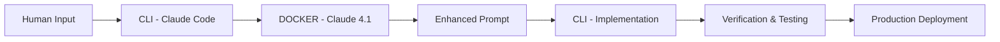

# CLI-DOCKER-CLI Development Workflow

## Overview
This document defines the professional engineering workflow for the Disaster Recovery platform, utilizing a three-stage process to ensure world-class implementation quality.

## Workflow Architecture



## Stage 1: CLI Initial Processing (Claude Code)
**Purpose**: Understand and analyze the human request

### Tasks:
1. Parse human input for intent and requirements
2. Identify technical scope and constraints
3. Check existing codebase for context
4. Prepare structured requirements for enhancement

### Output Format:
```json
{
  "original_request": "Human's raw input",
  "intent": "Identified primary goal",
  "technical_scope": ["affected_systems"],
  "constraints": ["existing_limitations"],
  "context": "Relevant codebase information"
}
```

## Stage 2: DOCKER Enhancement (Claude 4.1)
**Purpose**: Transform request into world-beating engineering specification

### Enhancement Criteria:
1. **Scalability**: Design for 1M+ users from day one
2. **Performance**: Sub-100ms response times
3. **Security**: Zero-trust architecture principles
4. **Maintainability**: SOLID principles, clean architecture
5. **Testing**: 100% critical path coverage
6. **Documentation**: Self-documenting code with comprehensive JSDoc
7. **SEO**: Schema.org structured data, Core Web Vitals optimization
8. **Accessibility**: WCAG 2.1 AAA compliance
9. **International**: Multi-language, multi-currency ready
10. **AI-First**: LLM-optimized data structures

### Prompt Enhancement Template:
```typescript
interface EnhancedPrompt {
  // Business Requirements
  businessGoals: string[];
  successMetrics: KPI[];
  userStories: UserStory[];
  
  // Technical Specification
  architecture: {
    pattern: 'microservices' | 'monolithic' | 'serverless';
    components: Component[];
    dataFlow: DataFlow[];
    integrations: Integration[];
  };
  
  // Implementation Details
  implementation: {
    phases: Phase[];
    dependencies: Dependency[];
    migrations: Migration[];
    rollbackStrategy: RollbackPlan;
  };
  
  // Quality Assurance
  testing: {
    unit: TestSpec[];
    integration: TestSpec[];
    e2e: TestSpec[];
    performance: PerformanceTarget[];
  };
  
  // Deployment Strategy
  deployment: {
    environment: 'production' | 'staging' | 'development';
    cicd: Pipeline;
    monitoring: Monitor[];
    alerts: Alert[];
  };
}
```

## Stage 3: CLI Implementation (Claude Code)
**Purpose**: Execute the enhanced specification with precision

### Implementation Checklist:
- [ ] Create feature branch
- [ ] Implement core functionality
- [ ] Write comprehensive tests
- [ ] Update documentation
- [ ] Run linting and type checking
- [ ] Performance optimization
- [ ] Security audit
- [ ] Accessibility testing
- [ ] SEO validation
- [ ] Create pull request

## Workflow Commands

### Initialize Workflow
```bash
# Stage 1: Capture request
claude-code --capture-request "Your request here"

# Stage 2: Enhance in Docker
docker exec -it claude-main npm run enhance-prompt

# Stage 3: Implement enhanced spec
claude-code --implement-enhanced
```

### Verification Pipeline
```bash
# Run full verification suite
npm run verify:all

# Individual checks
npm run lint
npm run typecheck
npm run test
npm run test:e2e
npm run lighthouse
npm run security:audit
```

## Quality Gates

### Before Docker Enhancement:
1. Request is clear and unambiguous
2. Technical feasibility confirmed
3. No conflicts with existing features

### Before Implementation:
1. Enhanced prompt reviewed and approved
2. All dependencies available
3. Test scenarios defined

### Before Deployment:
1. All tests passing (100%)
2. Performance benchmarks met
3. Security scan clean
4. Accessibility audit passed
5. SEO requirements satisfied

## Example Workflow

### Human Input:
"Add a new feature for contractor onboarding"

### Stage 1 - CLI Analysis:
```json
{
  "intent": "Create contractor onboarding system",
  "scope": ["CRM integration", "UI forms", "Database schema"],
  "constraints": ["Must integrate with existing auth"],
  "context": "Current system has basic user management"
}
```

### Stage 2 - Docker Enhancement:
```typescript
{
  businessGoals: [
    "Onboard 10,000 contractors in first month",
    "Reduce onboarding time to <5 minutes",
    "Achieve 95% completion rate"
  ],
  architecture: {
    pattern: "microservices",
    components: [
      "ContractorService",
      "ValidationService",
      "NotificationService",
      "DocumentService"
    ],
    dataFlow: [
      "Multi-step wizard with progress persistence",
      "Real-time validation",
      "Async document processing"
    ]
  },
  implementation: {
    phases: [
      "Phase 1: Core data model and API",
      "Phase 2: UI wizard components",
      "Phase 3: Integration and testing",
      "Phase 4: Performance optimization"
    ]
  }
}
```

### Stage 3 - CLI Implementation:
Execute enhanced specification with:
- Type-safe TypeScript implementation
- React Hook Form with Zod validation
- Prisma schema updates
- Jest/Playwright tests
- Storybook documentation
- Performance monitoring

## Performance Metrics

### Target Metrics:
- **API Response**: <100ms p95
- **Page Load**: <2s on 3G
- **First Contentful Paint**: <1.5s
- **Time to Interactive**: <3.5s
- **Cumulative Layout Shift**: <0.1
- **Test Coverage**: >90%
- **Lighthouse Score**: >95

## Security Requirements

### Implementation Must Include:
- Input sanitization
- SQL injection prevention
- XSS protection
- CSRF tokens
- Rate limiting
- Authentication checks
- Authorization validation
- Audit logging
- Data encryption

## Documentation Standards

### Every Feature Must Have:
1. **README.md** - Overview and usage
2. **API.md** - Endpoint documentation
3. **SCHEMA.md** - Database changes
4. **TESTING.md** - Test scenarios
5. **DEPLOYMENT.md** - Deployment guide

## Monitoring & Alerts

### Required Monitors:
- Error rate > 1%
- Response time > 500ms
- Memory usage > 80%
- CPU usage > 70%
- Failed deployments
- Security violations
- SEO degradation

## Rollback Strategy

### Automatic Rollback Triggers:
- Error rate spike (>5%)
- Response time degradation (>2x)
- Memory leak detected
- Security breach
- Critical bug in production

## Continuous Improvement

### Weekly Reviews:
- Performance metrics analysis
- Error log review
- User feedback incorporation
- Security updates
- Dependency updates

### Monthly Audits:
- Full security scan
- Accessibility testing
- SEO performance
- Code quality metrics
- Technical debt assessment

## Success Criteria

A feature is considered successfully implemented when:
1. ✅ All tests passing
2. ✅ Performance targets met
3. ✅ Security scan clean
4. ✅ Accessibility compliant
5. ✅ SEO optimized
6. ✅ Documentation complete
7. ✅ Code review approved
8. ✅ Deployed to production
9. ✅ Monitoring active
10. ✅ User acceptance verified

---

## Quick Reference

### Development Flow:
```
Human → CLI (Understand) → Docker (Enhance) → CLI (Implement) → Production
```

### Quality Gates:
```
Lint → Test → Build → Security → Performance → Deploy
```

### Rollback:
```
Monitor → Detect → Alert → Rollback → Investigate → Fix
```

This workflow ensures every feature is built to world-class standards, ready for global scale from day one.