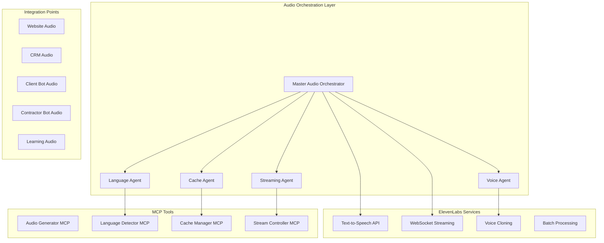

# 🎙️ NRP Multi-Language Audio System Architecture

## Executive Summary
Complete audio integration system for NRP Disaster Recovery Platform using ElevenLabs API with ElysiaJS, orchestrated agents, and Docker containerization for seamless multi-language support across all touchpoints.

## System Overview



## 1. Agent Hierarchy

### Master Audio Orchestrator (MAO)
**Purpose**: Coordinates all audio operations across the platform

```typescript
interface MasterAudioOrchestrator {
  id: 'audio-orchestrator';
  type: 'master';
  responsibilities: [
    'Route audio requests to appropriate agents',
    'Manage agent lifecycle',
    'Coordinate multi-platform audio delivery',
    'Handle fallback strategies'
  ];
  subAgents: [
    'language-agent',
    'voice-agent',
    'cache-agent',
    'streaming-agent'
  ];
}
```

### Primary Agents

#### 1. Language Agent
**Purpose**: Handles multi-language detection and routing

```typescript
interface LanguageAgent {
  id: 'language-agent';
  type: 'primary';
  capabilities: [
    'Auto-detect language from text',
    'Route to appropriate voice model',
    'Handle regional dialects',
    'Manage translation fallbacks'
  ];
  supportedLanguages: [
    'en-AU', // Australian English
    'en-US', // American English
    'zh',    // Mandarin Chinese
    'ar',    // Arabic
    'vi',    // Vietnamese
    'hi',    // Hindi
    'es',    // Spanish
    'fr',    // French
    'de',    // German
    'ja',    // Japanese
    'ko',    // Korean
    'id',    // Indonesian
    'th',    // Thai
    'tl'     // Tagalog
  ];
}
```

#### 2. Voice Agent
**Purpose**: Manages voice selection and customization

```typescript
interface VoiceAgent {
  id: 'voice-agent';
  type: 'primary';
  voiceProfiles: {
    emergency: {
      voiceId: 'emergency-authority',
      settings: {
        stability: 1.0,
        similarityBoost: 1.0,
        style: 0.2,
        useSpeakerBoost: true
      }
    },
    contractor: {
      voiceId: 'professional-contractor',
      settings: {
        stability: 0.8,
        similarityBoost: 0.9,
        style: 0.1
      }
    },
    client: {
      voiceId: 'friendly-assistant',
      settings: {
        stability: 0.7,
        similarityBoost: 0.8,
        style: 0.3
      }
    },
    learning: {
      voiceId: 'instructor-voice',
      settings: {
        stability: 0.9,
        similarityBoost: 1.0,
        style: 0.0
      }
    }
  };
}
```

#### 3. Cache Agent
**Purpose**: Optimizes performance and reduces API calls

```typescript
interface CacheAgent {
  id: 'cache-agent';
  type: 'primary';
  strategies: {
    static: 'Common phrases and emergency instructions',
    dynamic: 'Recently generated audio',
    pregenerated: 'Contractor training materials',
    realtime: 'TTL-based caching for live updates'
  };
  storage: {
    redis: 'In-memory for hot data',
    s3: 'Long-term storage for training materials',
    cdn: 'Edge caching for global distribution'
  };
}
```

#### 4. Streaming Agent
**Purpose**: Handles real-time audio streaming

```typescript
interface StreamingAgent {
  id: 'streaming-agent';
  type: 'primary';
  protocols: [
    'WebSocket for bidirectional streaming',
    'Server-Sent Events for unidirectional',
    'WebRTC for peer-to-peer',
    'HLS for adaptive streaming'
  ];
  contexts: {
    emergency: 'High priority, low latency',
    conversation: 'Interactive bot responses',
    broadcast: 'Multi-recipient announcements',
    learning: 'Sequential content delivery'
  };
}
```

### Sub-Agents

#### Audio Processing Sub-Agents

```typescript
interface AudioSubAgents {
  TextNormalizer: {
    purpose: 'Clean and prepare text for TTS',
    tasks: [
      'Remove HTML/markdown',
      'Expand abbreviations',
      'Handle numbers and units',
      'Add SSML tags for emphasis'
    ]
  },
  
  QualityController: {
    purpose: 'Ensure audio quality standards',
    tasks: [
      'Validate audio output',
      'Check volume levels',
      'Verify language match',
      'Monitor latency'
    ]
  },
  
  BatchProcessor: {
    purpose: 'Handle bulk audio generation',
    tasks: [
      'Queue management',
      'Parallel processing',
      'Progress tracking',
      'Error recovery'
    ]
  },
  
  EmergencyPrioritizer: {
    purpose: 'Prioritize emergency audio',
    tasks: [
      'Queue jumping for emergencies',
      'Resource allocation',
      'Fallback voice selection',
      'Latency optimization'
    ]
  }
}
```

## 2. Integration Architecture

### Website Integration

```typescript
// Frontend Audio Component
class WebAudioIntegration {
  private audioOrchestrator: MasterAudioOrchestrator;
  private userLanguage: string;
  
  async playPageContent(elementId: string) {
    const text = document.getElementById(elementId).textContent;
    const audioUrl = await this.audioOrchestrator.generateAudio({
      text,
      language: this.userLanguage,
      context: 'website',
      voice: 'client'
    });
    
    const audio = new Audio(audioUrl);
    audio.play();
  }
  
  async streamEmergencyAnnouncement(message: string) {
    const stream = await this.audioOrchestrator.streamAudio({
      text: message,
      priority: 'critical',
      voice: 'emergency',
      broadcast: true
    });
    
    // Handle streaming audio
    stream.on('data', chunk => this.playChunk(chunk));
  }
}
```

### CRM Integration

```typescript
// CRM Audio Service
class CRMAudioService {
  async generateContractorNotification(contractor: Contractor, job: Job) {
    const message = this.buildNotificationMessage(contractor, job);
    
    return await audioOrchestrator.generateAudio({
      text: message,
      language: contractor.preferredLanguage,
      voice: 'contractor',
      cache: true,
      context: {
        contractorId: contractor.id,
        jobId: job.id
      }
    });
  }
  
  async batchGenerateTrainingAudio(materials: TrainingMaterial[]) {
    return await audioOrchestrator.batchProcess({
      items: materials.map(m => ({
        text: m.content,
        language: m.language,
        voice: 'learning',
        outputFormat: 'mp3_44100_128',
        cache: 'permanent'
      })),
      priority: 'low',
      callback: this.onTrainingAudioGenerated
    });
  }
}
```

### Bot Integration

```typescript
// Client Bot Audio
class ClientBotAudio {
  private wsConnection: WebSocket;
  
  async respondWithAudio(query: string, response: string, context: BotContext) {
    // Generate audio response
    const audioStream = await audioOrchestrator.streamAudio({
      text: response,
      language: context.userLanguage,
      voice: 'client',
      streaming: true,
      context: {
        sessionId: context.sessionId,
        emergencyLevel: context.emergencyLevel
      }
    });
    
    // Send audio chunks via WebSocket
    audioStream.on('chunk', chunk => {
      this.wsConnection.send({
        type: 'audio_chunk',
        data: chunk,
        metadata: {
          sessionId: context.sessionId,
          chunkIndex: chunk.index
        }
      });
    });
  }
}

// Contractor Bot Audio
class ContractorBotAudio {
  async generateJobBriefing(job: Job, contractor: Contractor) {
    const briefing = this.createJobBriefing(job);
    
    const audio = await audioOrchestrator.generateAudio({
      text: briefing,
      language: contractor.language,
      voice: 'contractor',
      ssml: true,
      emphasis: {
        location: 'strong',
        urgency: 'strong',
        customerName: 'moderate'
      }
    });
    
    return {
      audioUrl: audio.url,
      duration: audio.duration,
      transcript: briefing
    };
  }
}
```

### Learning Section Integration

```typescript
// Contractor Learning Audio
class LearningAudioService {
  async generateCourseAudio(course: Course) {
    const chapters = await this.getChapters(course.id);
    
    // Generate audio for each chapter
    const audioChapters = await Promise.all(
      chapters.map(chapter => 
        audioOrchestrator.generateAudio({
          text: chapter.content,
          language: course.language,
          voice: 'learning',
          ssml: this.addEducationalSSML(chapter.content),
          cache: 'permanent',
          metadata: {
            courseId: course.id,
            chapterId: chapter.id,
            duration: 'estimate'
          }
        })
      )
    );
    
    return this.createAudioPlaylist(audioChapters);
  }
  
  async generateInteractiveQuizAudio(quiz: Quiz, language: string) {
    const questions = await Promise.all(
      quiz.questions.map(q => ({
        question: audioOrchestrator.generateAudio({
          text: q.text,
          language,
          voice: 'learning',
          pauseAfter: 5000 // 5 second pause for answer
        }),
        options: q.options.map(opt => 
          audioOrchestrator.generateAudio({
            text: opt.text,
            language,
            voice: 'learning'
          })
        )
      }))
    );
    
    return questions;
  }
}
```

## 3. MCP Tool Definitions

### Audio Generator MCP

```typescript
interface AudioGeneratorMCP {
  name: 'audio-generator-mcp';
  version: '1.0.0';
  
  tools: {
    generateAudio: {
      description: 'Generate audio from text using ElevenLabs',
      parameters: {
        text: string;
        language?: string;
        voiceId?: string;
        format?: AudioFormat;
        settings?: VoiceSettings;
      };
      returns: {
        audioUrl: string;
        duration: number;
        size: number;
        cached: boolean;
      };
    },
    
    streamAudio: {
      description: 'Stream audio in real-time',
      parameters: {
        text: string;
        contextId: string;
        priority: 'low' | 'medium' | 'high' | 'critical';
      };
      returns: ReadableStream;
    },
    
    cloneVoice: {
      description: 'Clone a voice for consistent branding',
      parameters: {
        samples: File[];
        voiceName: string;
        description: string;
      };
      returns: {
        voiceId: string;
        status: 'pending' | 'ready';
      };
    }
  };
}
```

### Language Detector MCP

```typescript
interface LanguageDetectorMCP {
  name: 'language-detector-mcp';
  
  tools: {
    detectLanguage: {
      description: 'Detect language from text',
      parameters: { text: string };
      returns: {
        language: string;
        confidence: number;
        alternatives: Array<{lang: string; confidence: number}>;
      };
    },
    
    translateForAudio: {
      description: 'Translate text optimized for TTS',
      parameters: {
        text: string;
        fromLang: string;
        toLang: string;
      };
      returns: {
        translatedText: string;
        audioOptimized: boolean;
      };
    }
  };
}
```

### Cache Manager MCP

```typescript
interface CacheManagerMCP {
  name: 'cache-manager-mcp';
  
  tools: {
    checkCache: {
      description: 'Check if audio exists in cache',
      parameters: {
        textHash: string;
        language: string;
        voiceId: string;
      };
      returns: {
        exists: boolean;
        url?: string;
        ttl?: number;
      };
    },
    
    saveToCache: {
      description: 'Save audio to cache',
      parameters: {
        audioData: Buffer;
        metadata: CacheMetadata;
        ttl?: number;
      };
      returns: { success: boolean; key: string };
    },
    
    preGenerateCache: {
      description: 'Pre-generate common audio',
      parameters: {
        phrases: string[];
        languages: string[];
        voices: string[];
      };
      returns: { generated: number; failed: number };
    }
  };
}
```

### Stream Controller MCP

```typescript
interface StreamControllerMCP {
  name: 'stream-controller-mcp';
  
  tools: {
    createStream: {
      description: 'Create audio stream session',
      parameters: {
        sessionId: string;
        protocol: 'websocket' | 'sse' | 'webrtc';
      };
      returns: { streamId: string; endpoint: string };
    },
    
    manageStream: {
      description: 'Control stream playback',
      parameters: {
        streamId: string;
        action: 'pause' | 'resume' | 'stop' | 'skip';
      };
      returns: { success: boolean; state: string };
    },
    
    broadcastStream: {
      description: 'Broadcast to multiple recipients',
      parameters: {
        audioStream: ReadableStream;
        recipients: string[];
        priority: string;
      };
      returns: { delivered: number; failed: number };
    }
  };
}
```

## 4. Docker Configuration

### docker-compose.audio.yml

```yaml
version: '3.9'

services:
  audio-orchestrator:
    build:
      context: ./audio-system
      dockerfile: Dockerfile.orchestrator
    environment:
      - ELEVENLABS_API_KEY=${ELEVENLABS_API_KEY}
      - SELECTED_VOICE_ID=${SELECTED_VOICE_ID}
      - REDIS_URL=redis://audio-cache:6379
      - WS_URL=ws://websocket-server:3002
    ports:
      - "3007:3007"
    depends_on:
      - audio-cache
      - audio-processor
    networks:
      - nrp-network
    volumes:
      - audio-data:/app/audio-cache
    deploy:
      replicas: 2
      resources:
        limits:
          memory: 512M
        reservations:
          memory: 256M

  audio-processor:
    build:
      context: ./audio-system
      dockerfile: Dockerfile.processor
    environment:
      - ELEVENLABS_API_KEY=${ELEVENLABS_API_KEY}
      - BATCH_SIZE=10
      - MAX_CONCURRENT=5
    networks:
      - nrp-network
    deploy:
      replicas: 3
      resources:
        limits:
          memory: 1G
        reservations:
          memory: 512M

  audio-cache:
    image: redis:7-alpine
    ports:
      - "6380:6379"
    volumes:
      - audio-cache-data:/data
    networks:
      - nrp-network
    command: redis-server --appendonly yes

  audio-cdn:
    image: nginx:alpine
    ports:
      - "3008:80"
    volumes:
      - ./audio-system/nginx.conf:/etc/nginx/nginx.conf:ro
      - audio-data:/usr/share/nginx/html/audio:ro
    networks:
      - nrp-network
    depends_on:
      - audio-orchestrator

  language-service:
    build:
      context: ./audio-system
      dockerfile: Dockerfile.language
    environment:
      - SUPPORTED_LANGUAGES=${SUPPORTED_LANGUAGES}
      - DEFAULT_LANGUAGE=en-AU
    networks:
      - nrp-network
    deploy:
      replicas: 2

volumes:
  audio-data:
  audio-cache-data:

networks:
  nrp-network:
    external: true
```

## 5. ElysiaJS Audio Server Implementation

### Main Audio Server (ElysiaJS)

```typescript
// audio-system/src/server.ts
import { Elysia } from 'elysia';
import { cors } from '@elysiajs/cors';
import { swagger } from '@elysiajs/swagger';
import { AudioOrchestrator } from './orchestrator';
import { LanguageAgent } from './agents/language';
import { VoiceAgent } from './agents/voice';
import { CacheAgent } from './agents/cache';
import { StreamingAgent } from './agents/streaming';

const app = new Elysia()
  .use(cors())
  .use(swagger())
  .decorate('orchestrator', new AudioOrchestrator())
  .decorate('agents', {
    language: new LanguageAgent(),
    voice: new VoiceAgent(),
    cache: new CacheAgent(),
    streaming: new StreamingAgent()
  })
  
  // Generate audio endpoint
  .post('/audio/generate', async ({ body, orchestrator }) => {
    const { text, language, context, voice, priority } = body;
    
    const audio = await orchestrator.generateAudio({
      text,
      language: language || 'auto',
      context,
      voice,
      priority: priority || 'medium'
    });
    
    return {
      success: true,
      audio: {
        url: audio.url,
        duration: audio.duration,
        language: audio.detectedLanguage,
        cached: audio.fromCache
      }
    };
  })
  
  // Stream audio endpoint
  .ws('/audio/stream', {
    open(ws) {
      console.log('Audio stream client connected');
      ws.data.streamId = crypto.randomUUID();
    },
    
    async message(ws, message) {
      const { text, language, context, voice } = JSON.parse(message);
      
      const stream = await ws.data.orchestrator.streamAudio({
        text,
        language,
        context,
        voice,
        streamId: ws.data.streamId
      });
      
      stream.on('chunk', chunk => {
        ws.send(JSON.stringify({
          type: 'audio_chunk',
          data: chunk.toString('base64'),
          index: chunk.index,
          final: chunk.final
        }));
      });
    },
    
    close(ws) {
      console.log('Audio stream client disconnected');
      ws.data.orchestrator.closeStream(ws.data.streamId);
    }
  })
  
  // Batch processing endpoint
  .post('/audio/batch', async ({ body, orchestrator }) => {
    const { items, priority, callback } = body;
    
    const jobId = await orchestrator.batchProcess({
      items,
      priority: priority || 'low',
      callback
    });
    
    return {
      success: true,
      jobId,
      status: 'queued',
      estimatedTime: items.length * 2 // seconds
    };
  })
  
  // Language detection endpoint
  .post('/audio/detect-language', async ({ body, agents }) => {
    const { text } = body;
    const result = await agents.language.detect(text);
    
    return {
      success: true,
      language: result.language,
      confidence: result.confidence,
      alternatives: result.alternatives
    };
  })
  
  // Cache management endpoints
  .get('/audio/cache/:hash', async ({ params, agents }) => {
    const cached = await agents.cache.get(params.hash);
    
    if (cached) {
      return {
        success: true,
        found: true,
        url: cached.url,
        ttl: cached.ttl
      };
    }
    
    return { success: true, found: false };
  })
  
  .post('/audio/cache/pregenerate', async ({ body, orchestrator }) => {
    const { phrases, languages, voices } = body;
    
    const result = await orchestrator.preGenerateCache({
      phrases,
      languages: languages || ['en-AU'],
      voices: voices || ['default']
    });
    
    return {
      success: true,
      generated: result.generated,
      failed: result.failed,
      cached: result.urls
    };
  })
  
  // Voice management endpoints
  .post('/audio/voice/clone', async ({ body, agents }) => {
    const { samples, name, description } = body;
    
    const voice = await agents.voice.cloneVoice({
      samples,
      name,
      description
    });
    
    return {
      success: true,
      voiceId: voice.id,
      status: voice.status
    };
  })
  
  .get('/audio/voice/list', async ({ agents }) => {
    const voices = await agents.voice.listVoices();
    
    return {
      success: true,
      voices: voices.map(v => ({
        id: v.id,
        name: v.name,
        languages: v.languages,
        contexts: v.contexts
      }))
    };
  })
  
  // Health check
  .get('/audio/health', () => ({
    status: 'healthy',
    timestamp: new Date(),
    services: {
      elevenlabs: 'connected',
      cache: 'connected',
      streaming: 'active'
    }
  }))
  
  .listen(3007);

console.log('🎙️ Audio System running on http://localhost:3007');
```

## 6. Implementation Phases

### Phase 1: Core Infrastructure (Week 1)
- [ ] Set up ElevenLabs API integration
- [ ] Create audio orchestrator service
- [ ] Implement basic TTS generation
- [ ] Set up Redis caching

### Phase 2: Agent Implementation (Week 2)
- [ ] Develop language detection agent
- [ ] Create voice management agent
- [ ] Implement cache agent
- [ ] Build streaming agent

### Phase 3: Platform Integration (Week 3)
- [ ] Website audio components
- [ ] CRM audio notifications
- [ ] Client bot audio responses
- [ ] Contractor bot audio briefs

### Phase 4: Advanced Features (Week 4)
- [ ] Multi-language support
- [ ] Voice cloning setup
- [ ] Batch processing
- [ ] Real-time streaming

### Phase 5: Learning Integration (Week 5)
- [ ] Course audio generation
- [ ] Interactive quiz audio
- [ ] Progress tracking
- [ ] Offline download support

### Phase 6: Testing & Optimization (Week 6)
- [ ] Performance testing
- [ ] Multi-language testing
- [ ] Cache optimization
- [ ] Load balancing

## 7. Critical Success Factors

### Performance Metrics
- **Latency**: < 500ms for cached content, < 2s for generation
- **Streaming**: < 100ms chunk delivery
- **Cache Hit Rate**: > 80% for common phrases
- **Language Detection**: > 95% accuracy
- **Concurrent Streams**: Support 1000+ simultaneous

### Quality Standards
- **Voice Consistency**: Same voice across all touchpoints
- **Language Accuracy**: Native speaker quality
- **Audio Quality**: 44.1kHz, 128kbps minimum
- **Accessibility**: WCAG 2.1 AAA compliant

### Security Requirements
- **API Key Management**: Secure vault storage
- **Audio Encryption**: TLS for streaming
- **Access Control**: Role-based permissions
- **Content Filtering**: Prevent inappropriate content

## 8. Cost Optimization Strategy

### Caching Strategy
- Pre-generate common emergency phrases
- Cache contractor training materials
- Store frequently accessed content
- Implement TTL-based expiration

### Model Selection
- Use `eleven_flash_v2_5` for real-time
- Use `eleven_multilingual_v2` for quality
- Batch process during off-peak hours
- Implement request stitching

### Resource Management
- Auto-scale based on demand
- Implement queue prioritization
- Use CDN for static audio
- Compress audio for mobile

## 9. Monitoring & Analytics

### Key Metrics
- Audio generation requests/second
- Cache hit/miss ratio
- Language distribution
- Stream quality metrics
- Error rates by component

### Dashboards
- Real-time audio generation
- Language usage heatmap
- Voice utilization
- Cost per audio minute
- User engagement metrics

## 10. Disaster Recovery

### Fallback Strategies
- Secondary TTS provider
- Pre-recorded emergency messages
- Text-only fallback
- Regional cache servers

### Backup Systems
- Audio archive in S3
- Database replication
- Multi-region deployment
- Automated failover

---

**Architecture Version**: 1.0.0
**Last Updated**: September 2025
**Status**: Ready for Implementation