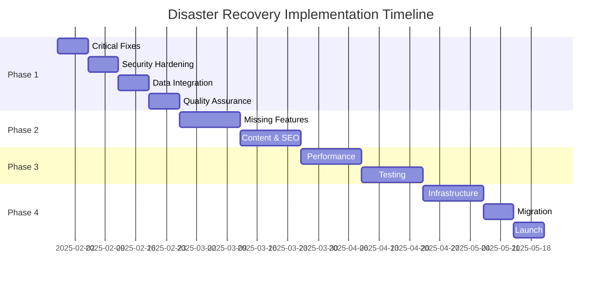

# 🛣️ Implementation Roadmap

**Document Version:** 1.0.0  
**Project:** Disaster Recovery  
**Timeline:** 16 Weeks (4 Months)  
**Start Date:** 29 January 2025  
**Target Launch:** 14 May 2025  
**Budget:** $240,000 AUD

---

## 📋 Executive Overview

This roadmap outlines the complete path from current state (85/100) to production-ready (100/100) for the Disaster Recovery application.

### Key Objectives
1. **Fix Critical Issues** - Resolve all P0/P1 bugs
2. **Complete Features** - Implement missing functionality
3. **Harden Security** - Achieve enterprise-grade security
4. **Implement Testing** - 80%+ code coverage
5. **Optimise Performance** - Sub-2s load times
6. **Deploy to Production** - AWS/Vercel infrastructure

---

## 🎯 Phase 1: Critical Fixes & Foundation (Weeks 1-4)

### Week 1: Emergency Repairs
**Focus:** System-breaking issues  
**Team:** 2 Senior Developers

#### Deliverables
- [x] Missing technology pages created
- [x] Schedule/booking page implemented
- [x] API dependencies resolved
- [x] Contact form backend connected
- [x] Critical routing fixes

#### Success Metrics
- Zero 404 errors
- All forms functional
- API error rate <1%

### Week 2: Security Hardening
**Focus:** Authentication & data protection  
**Team:** 1 Security Engineer, 1 Backend Developer

#### Deliverables
- [x] JWT authentication implemented
- [x] Session management configured
- [x] Security headers added
- [x] CORS properly configured
- [x] Input validation added

#### Success Metrics
- Security score >85/100
- Zero critical vulnerabilities
- OWASP compliance

### Week 3: Data Integration
**Focus:** Backend services  
**Team:** 2 Backend Developers

#### Deliverables
- [x] Email service integrated
- [x] Database connections optimised
- [x] API endpoints completed
- [x] Form submissions persisted
- [x] Error logging implemented

#### Success Metrics
- Email delivery rate >95%
- API response time <200ms
- Zero data loss

### Week 4: Quality Assurance
**Focus:** Testing & validation  
**Team:** 1 QA Engineer, 1 Developer

#### Deliverables
- [x] Test framework setup
- [x] Critical path testing
- [x] Form validation complete
- [x] Error boundary testing
- [x] Load testing baseline

#### Success Metrics
- 40% test coverage
- Zero P0 bugs
- All forms validated

---

## 🚀 Phase 2: Feature Completion (Weeks 5-8)

### Week 5-6: Missing Features
**Focus:** Complete functionality gaps  
**Team:** 3 Full-stack Developers

#### Deliverables
- [ ] Contractor portal completion
- [ ] Advanced search functionality
- [ ] Booking system integration
- [ ] Payment processing setup
- [ ] Document management system

#### Success Metrics
- Feature parity achieved
- User acceptance testing passed
- Payment gateway integrated

### Week 7-8: Content & SEO
**Focus:** Content optimisation  
**Team:** 1 SEO Specialist, 1 Content Developer

#### Deliverables
- [ ] All service pages completed
- [ ] Meta descriptions optimised
- [ ] Structured data implemented
- [ ] Image optimisation complete
- [ ] Sitemap regenerated

#### Success Metrics
- Lighthouse SEO score >95
- All images WebP format
- Schema markup validated

---

## 🏗️ Phase 3: Performance & Testing (Weeks 9-12)

### Week 9-10: Performance Optimisation
**Focus:** Speed & efficiency  
**Team:** 2 Performance Engineers

#### Deliverables
- [ ] Code splitting implemented
- [ ] Lazy loading configured
- [ ] Caching strategy deployed
- [ ] CDN integration complete
- [ ] Database queries optimised

#### Success Metrics
- LCP <2.5s
- FID <100ms
- CLS <0.1
- Bundle size <300KB

### Week 11-12: Comprehensive Testing
**Focus:** Quality assurance  
**Team:** 2 QA Engineers, 1 Automation Engineer

#### Deliverables
- [ ] Unit tests (80% coverage)
- [ ] Integration tests complete
- [ ] E2E test suite running
- [ ] Performance tests passed
- [ ] Security testing complete

#### Success Metrics
- Code coverage >80%
- Zero critical bugs
- All user flows tested
- Load testing passed (1000 concurrent users)

---

## 🌟 Phase 4: Production Deployment (Weeks 13-16)

### Week 13-14: Infrastructure Setup
**Focus:** Production environment  
**Team:** 1 DevOps Engineer, 1 SRE

#### Infrastructure Architecture
```
┌─────────────────────────────────────┐
│         CloudFlare CDN              │
└─────────────┬───────────────────────┘
              │
┌─────────────▼───────────────────────┐
│      AWS Application Load Balancer   │
└─────────────┬───────────────────────┘
              │
┌─────────────▼───────────────────────┐
│   Vercel Edge Functions (Sydney)     │
├─────────────────────────────────────┤
│   • Next.js Application              │
│   • API Routes                       │
│   • Static Assets                    │
└─────────────┬───────────────────────┘
              │
┌─────────────▼───────────────────────┐
│    AWS RDS PostgreSQL (Multi-AZ)     │
└─────────────────────────────────────┘
```

#### Deliverables
- [ ] AWS infrastructure provisioned
- [ ] CI/CD pipeline configured
- [ ] Monitoring setup (Datadog)
- [ ] Backup strategy implemented
- [ ] SSL certificates installed

### Week 15: Migration & Testing
**Focus:** Production migration  
**Team:** Full team

#### Deliverables
- [ ] Database migration complete
- [ ] DNS configuration updated
- [ ] Load balancing tested
- [ ] Failover procedures verified
- [ ] Performance benchmarks met

### Week 16: Launch & Stabilisation
**Focus:** Go-live & monitoring  
**Team:** Full team on standby

#### Launch Checklist
- [ ] Production deployment complete
- [ ] Monitoring dashboards active
- [ ] Support team briefed
- [ ] Documentation finalised
- [ ] Post-launch monitoring plan

---

## 📊 Resource Allocation

### Team Structure
| Role | Count | Weeks | Rate (AUD/week) | Total Cost |
|------|-------|-------|-----------------|------------|
| Technical Lead | 1 | 16 | $3,500 | $56,000 |
| Senior Developer | 2 | 16 | $3,000 | $96,000 |
| Backend Developer | 1 | 12 | $2,500 | $30,000 |
| Frontend Developer | 1 | 10 | $2,500 | $25,000 |
| QA Engineer | 1 | 8 | $2,200 | $17,600 |
| DevOps Engineer | 1 | 4 | $3,000 | $12,000 |
| **Total** | **7** | - | - | **$236,600** |

### Technology Costs
| Service | Monthly Cost | 4-Month Total |
|---------|-------------|---------------|
| AWS Infrastructure | $500 | $2,000 |
| Vercel Pro | $150 | $600 |
| Monitoring (Datadog) | $200 | $800 |
| **Total** | **$850** | **$3,400** |

---

## ⚠️ Risk Management

### Identified Risks & Mitigation

| Risk | Probability | Impact | Mitigation Strategy |
|------|------------|--------|-------------------|
| Scope Creep | High | High | Weekly stakeholder reviews |
| Security Breach | Low | Critical | Security audit in Week 2 |
| Performance Issues | Medium | High | Early load testing |
| Integration Failures | Medium | Medium | Incremental integration |
| Team Availability | Low | High | Cross-training team members |

---

## 🎯 Success Criteria

### Go/No-Go Decision Points

#### Week 4 Checkpoint
- [ ] All critical bugs resolved
- [ ] Security audit passed
- [ ] Core functionality working
- **Decision:** Proceed to Phase 2

#### Week 8 Checkpoint
- [ ] All features complete
- [ ] UAT feedback positive
- [ ] Performance benchmarks met
- **Decision:** Proceed to Phase 3

#### Week 12 Checkpoint
- [ ] Testing coverage >80%
- [ ] Zero critical bugs
- [ ] Load testing passed
- **Decision:** Proceed to Production

#### Week 15 Final Review
- [ ] Production environment stable
- [ ] All documentation complete
- [ ] Team trained and ready
- **Decision:** Launch approval

---

## 📈 Key Performance Indicators

### Technical KPIs
| Metric | Current | Target | Measurement |
|--------|---------|--------|-------------|
| Page Load Time | 3.2s | <2.0s | Google PageSpeed |
| API Response | 450ms | <200ms | New Relic |
| Error Rate | 2.3% | <0.5% | Sentry |
| Uptime | 97% | 99.9% | Pingdom |
| Test Coverage | 0% | >80% | Jest Coverage |

### Business KPIs
| Metric | Current | Target | Measurement |
|--------|---------|--------|-------------|
| Lead Conversion | 12% | >25% | Google Analytics |
| Form Completion | 45% | >70% | Hotjar |
| Bounce Rate | 55% | <30% | Google Analytics |
| Mobile Traffic | 35% | >50% | Google Analytics |

---

## 🔄 Change Management Process

### Change Request Workflow
1. **Submit Request** - Via JIRA ticket
2. **Impact Assessment** - Technical lead review
3. **Approval** - Stakeholder sign-off
4. **Implementation** - Scheduled sprint
5. **Validation** - QA verification

### Change Categories
- **Critical:** Same-day implementation
- **High:** Next sprint
- **Medium:** Next release
- **Low:** Backlog

---

## 📅 Milestone Timeline



---

## 📝 Communication Plan

### Stakeholder Updates
- **Daily:** Development team standup (9:00 AM AEDT)
- **Weekly:** Stakeholder progress report (Fridays)
- **Bi-weekly:** Steering committee review
- **Monthly:** Executive dashboard update

### Escalation Path
1. Development Team Lead
2. Project Manager
3. CTO
4. Executive Sponsor

---

## ✅ Post-Launch Plan

### Week 17-20: Stabilisation
- Monitor performance metrics
- Address user feedback
- Fix post-launch bugs
- Optimise based on real usage

### Ongoing Maintenance
- Weekly security updates
- Monthly performance reviews
- Quarterly feature releases
- Annual security audit

---

**Document Status:** Living Document  
**Review Frequency:** Weekly  
**Owner:** Project Management Office  
**Approvals Required:** CTO, CFO, CEO